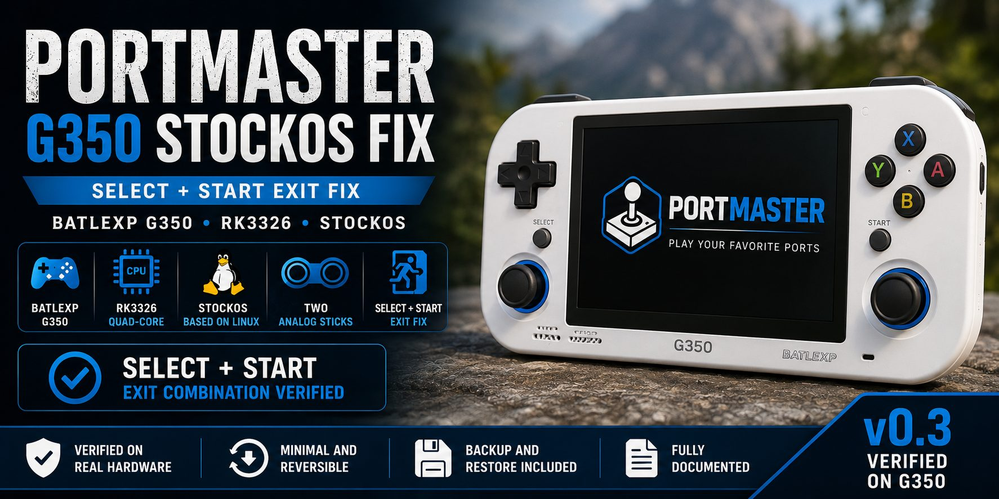

# PortMaster G350 StockOS Fix

Fix de compatibilidad verificado en hardware para la **BatleXP G350** con **StockOS**.

Este proyecto proporciona una solución mínima y reversible para la detección del mando por PortMaster y para recuperar la combinación de salida **SELECT + START** dentro de los ports.

## Estado

- Probado en hardware real
- BatleXP G350
- RK3326
- StockOS
- Dos sticks analógicos
- SDL 2.28.5
- Combinación SELECT + START verificada

> Este es un proyecto desarrollado por la comunidad. No constituye soporte oficial de PortMaster mientras los cambios no sean revisados y aceptados por el proyecto PortMaster.

## El problema

En la configuración probada de la BatleXP G350, PortMaster no disponía de una entrada específica para detectar correctamente el mando de la consola.

Como consecuencia, el mando no era seleccionado correctamente por la configuración de controles de PortMaster y la combinación **SELECT + START** no funcionaba para salir de los ports.

El propio sistema de la G350, sin embargo, identifica correctamente el mando mediante Linux y SDL.

## Identificación del hardware

El mando probado aparece en Linux como:

    batlexp_joypad

Dispositivos de entrada:

    /dev/input/event2
    /dev/input/js0

El mando dispone de:

    4 ejes
    17 botones
    0 hats

La versión de SDL utilizada durante las pruebas fue:

    SDL 2.28.5

GUID SDL verificado:

    1900c510010000000300000011010000

## Mapeado SDL verificado

El mapeado SDL utilizado es:

    1900c510010000000300000011010000,batlexp_joypad,a:b0,b:b1,x:b2,y:b3,leftshoulder:b4,rightshoulder:b5,dpup:b8,dpdown:b9,dpleft:b10,dpright:b11,leftx:a0,lefty:a1,rightx:a2,righty:a3,lefttrigger:b6,righttrigger:b7,back:b12,start:b13,crc:10c5,platform:Linux

Los botones utilizados para la combinación de salida son:

    SELECT = b12
    START  = b13

## La solución

La solución consta de dos cambios principales.

### 1. Detección de la BatleXP G350

`control.txt` detecta la G350 mediante:

    /dev/input/by-path/platform-batlexp-joypad-event-joystick

y asigna el GUID SDL verificado:

    1900c510010000000300000011010000

La configuración utiliza:

    param_device=g350
    ANALOGSTICKS=2
    LOWRES=N

### 2. Mapeado del mando

`gamecontrollerdb.txt` incorpora el mapeado SDL verificado de la G350, incluyendo:

    back:b12
    start:b13

## Verificación

La identificación del mando se comprobó utilizando las herramientas SDL disponibles en la propia G350.

El sistema detectó:

    batlexp_joypad

con:

    4 ejes
    17 botones

y el GUID:

    1900c510010000000300000011010000

Posteriormente se realizó una prueba específica con `gptokeyb`.

El resultado confirmó que:

    SELECT + START

cerraba correctamente el proceso objetivo.

## Instalación

Descarga el paquete desde la sección **Releases** del repositorio.

El paquete incluye:

- Instalador.
- Script de restauración.
- Copia de seguridad de los archivos modificados.

Los únicos archivos de PortMaster modificados son:

    control.txt
    gamecontrollerdb.txt

No es necesario modificar:

    kernel
    DTB
    gptokeyb
    gptokeyb2
    device_info.txt
    funcs.txt

para aplicar esta solución.

## Restauración

Si tienes cualquier problema después de instalar el fix, utiliza:

    restore.sh

para restaurar la configuración anterior de PortMaster.

## Compatibilidad

La solución ha sido verificada en:

| Hardware | Estado |
|---|---|
| BatleXP G350 | Probado |
| RK3326 | Probado |
| StockOS | Probado |
| Dos sticks analógicos | Probado |
| SDL 2.28.5 | Probado |

### Importante

La verificación se ha realizado sobre **una unidad física de BatleXP G350**.

Por ello, este proyecto no afirma que todas las revisiones de hardware de la G350 ni todas las versiones de StockOS utilicen exactamente el mismo GUID SDL.

Si tu G350 presenta un GUID diferente, abre un **Issue** indicando:

- Versión de StockOS.
- Versión de SDL.
- Nombre del mando.
- GUID SDL.
- Número de ejes y botones.
- Si SELECT + START permite salir de los ports.

## Versión

### v0.3

Primera versión verificada en hardware real.

El paquete instalable está disponible en **Releases**.

## Colaboración

Si tienes una BatleXP G350 y puedes probar esta solución, tu experiencia será bienvenida.

Los datos de otras unidades pueden ayudarnos a determinar si existen diferentes revisiones de hardware.

## Objetivo del proyecto

El objetivo final es que el soporte de la **BatleXP G350** pueda incorporarse directamente a PortMaster.

Hasta que eso ocurra, este repositorio proporciona una solución documentada, reversible y verificada para los usuarios afectados.

## Licencia

Consulta el archivo `LICENSE`.
